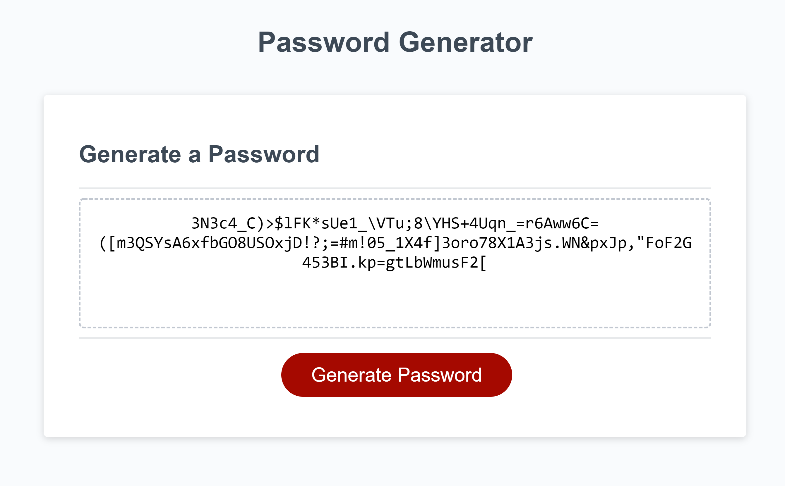

# js-password-gen
Password generator created in JavaScript. Creates passwords between 8 - 128 characters in length.
Can use Uppercase, lowercase, numeric, or special characters, or a combination.

Can be viewed at the following link(s):
- [Hosted Page on GitHub](https://jayarghargh.github.io/js-password-gen/)
- [Repository on GitHub](https://github.com/JayArghArgh/js-password-gen)



## Requirements
none.

## Setup
paste n go

## Files and Directories

```
|___README.md
|___index.html
|___assets
    |___css
    |   |___style.css
    |___images
    |   |___js_screen.png
    |___scripts
        |___script.js
```
